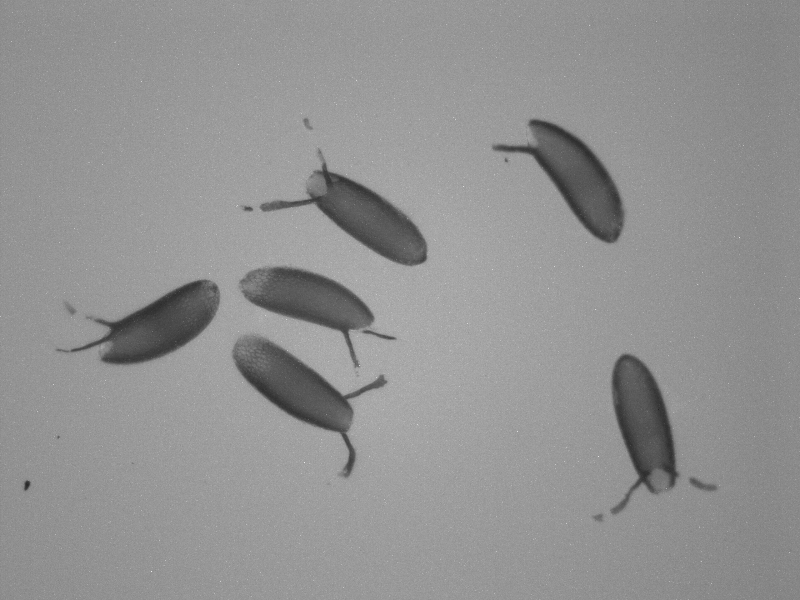
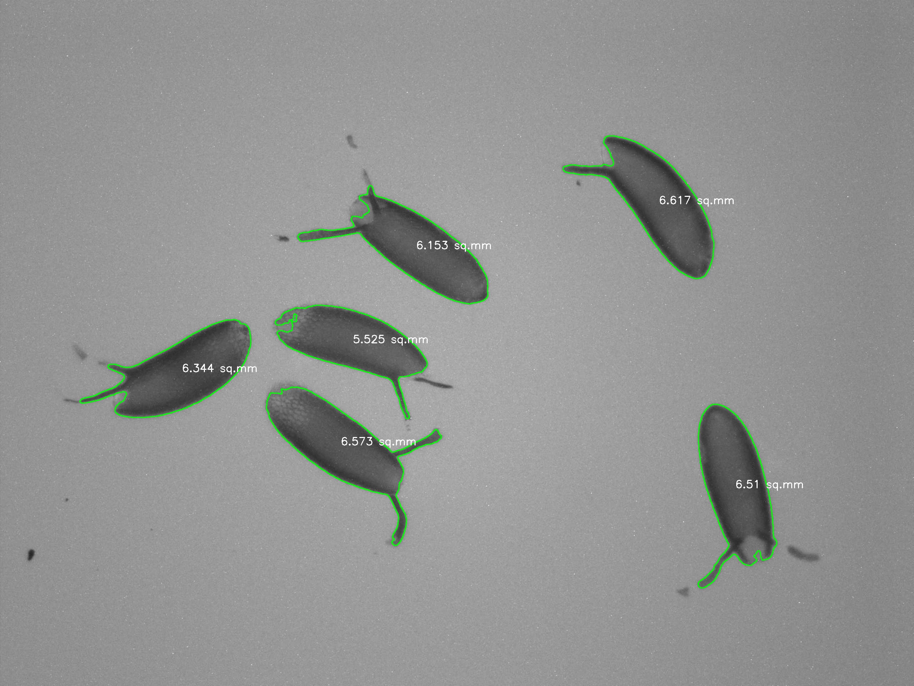
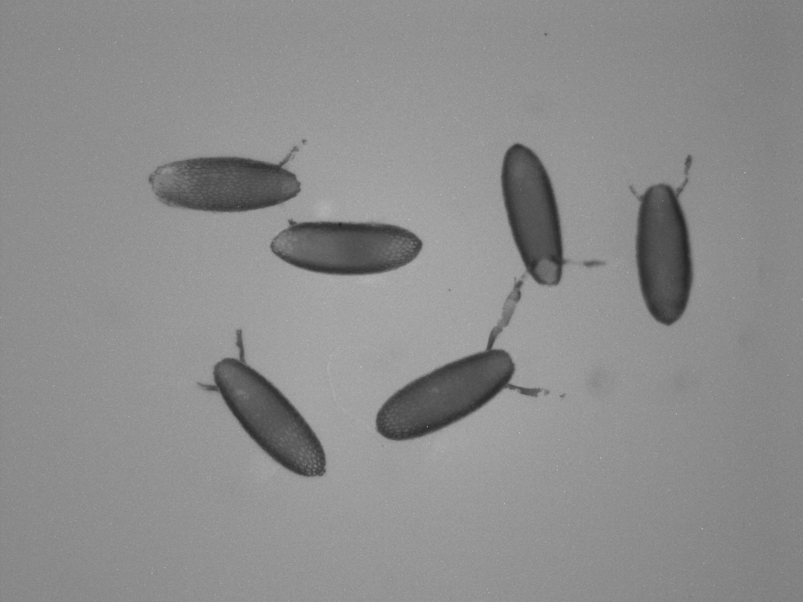
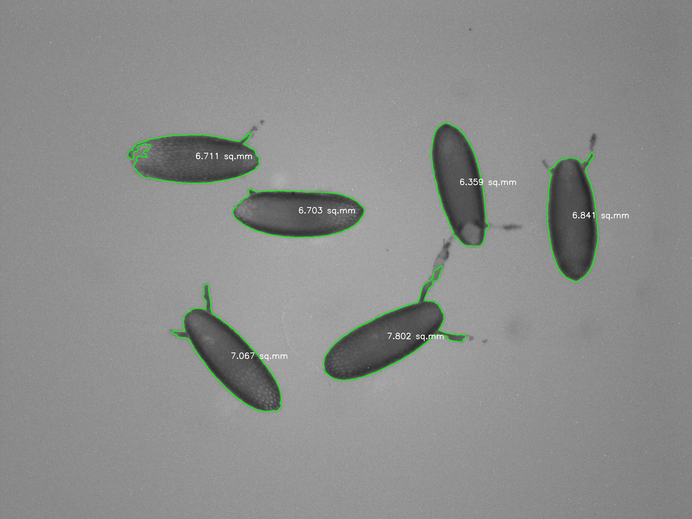
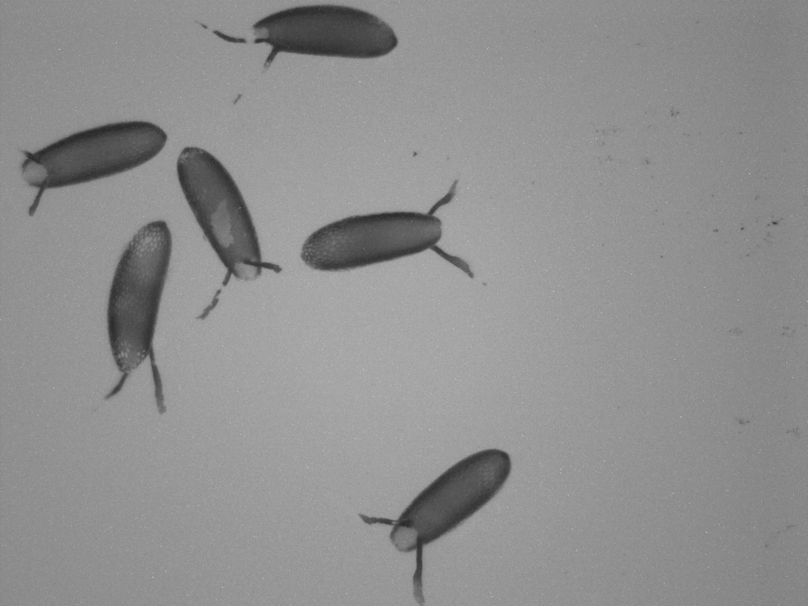
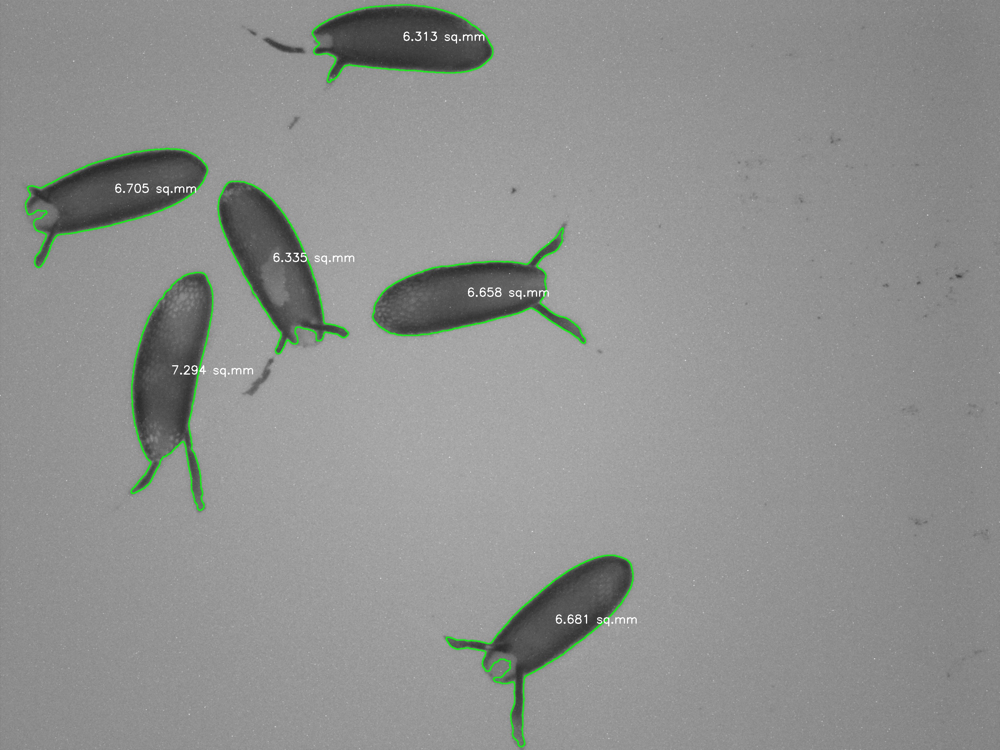

# Integrative-Genetics-and-Evolution-Laboratory
Projects and Lab Work for the IGEL laboratory under Professor Sudipta Tung
Main Areas : Fly Work (drosophila), Machine Learning, Population Modeling 
https://sites.google.com/ashoka.edu.in/igel

Created a pipeline where you can input images of drosophila eggs with a constant scale for all images
This will output excel files of egg sizes for each image
Using opencv and pandas

Currently working on removing the tentacles from the eggs to only measure the elliptical curve of the egg

